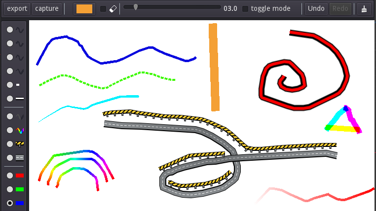

# Scratch Animator  
Scratch Animator is an [MIT](LICENSE) demo of an simple animation program with the [scratch canvas addon](https://github.com/boukew99/scratch_canvas) in the [Godot Engine](https://godotengine.org/). Try it out on the [webversion](https://howyoudoing.itch.io/scratch-animator). Features basic animation features, such as Drawing, Reordering (Drag & Drop), Adding, Duplicating, Removing, Naming and Saving frames. Install it from the [Godot Asset Library](https://godotengine.org/asset-library/asset/1273) under `Scratch Animator` or clone the project and import it in the [Godot Engine](https://godotengine.org/).

~243 lines of code  | ~45,3 kB <!--Properties-->

## Usage
Stages: Configuration, Save, Animate, Export

## Implementation
The projects consist of an [scratch animator scene](scratch_animator.tscn) with the [scratch animator script](script_animator.gd) attached. Here are the [icons](icons) also referenced. The scene is subdivided in an About Dialog and the Frames Interface, which control the frames. The frames consist out of [canvas scenes](canvas), which handle drawing.

## Creating a video from exported frames (for Windows)
Scratch Animator can save each frame individually as an image, but not in video format. Though Windows provides an tool to make a video from individual images. Do this by multi-selecting (Shift/Control + Click) the exported images and open the Right-Click menu and select `create a new video`. This opens the Photos tool. It provides multiple fun tools, but the most essential for our purpose is setting the aspect ratio (16:9 or 4:3) and setting frame duration. Then `Finish` the video and save it.

## Inspirations
Loosly taken inspirations from [Behind the Design: Looom](https://developer.apple.com/news/?id=s26ze13m) and [Loom user guide](https://www.iorama.studio/looom-user-guide).
